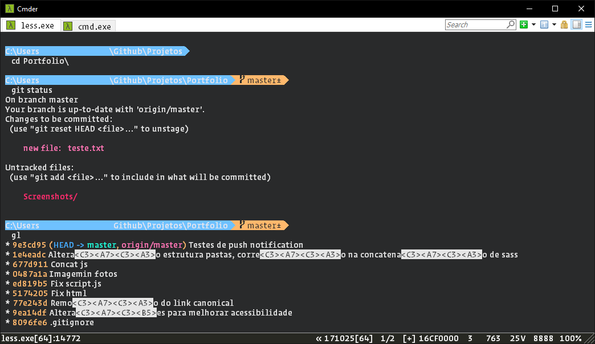

## Requirements

Download the AnonymousPro font

You'll be able to use any font in Cmder, but this font contains the symbols included in the prompt.

## Configuration

* Go to cmder folder
* Download the .lua file, and place it in %CMDER_ROOT%/config folder.
* Go to settings and import config.xml to get the theme

## Source

- Lua file by AmrEldib - [Cmder Powerline](https://github.com/AmrEldib/cmder-powerline-prompt)
